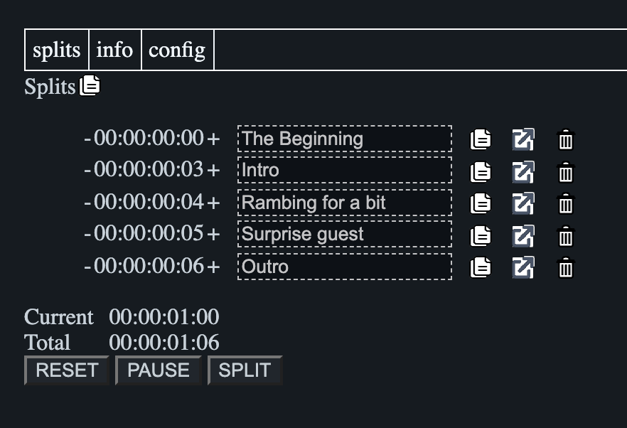

# splitsmaker

Create splits for video content.

## Open the app in github pages
https://putgeminmouth.github.io/splitsmaker/index.html

## Screenshot

## Credits

Requirements: [@manifestingred](https://github.com/manifestingred)

